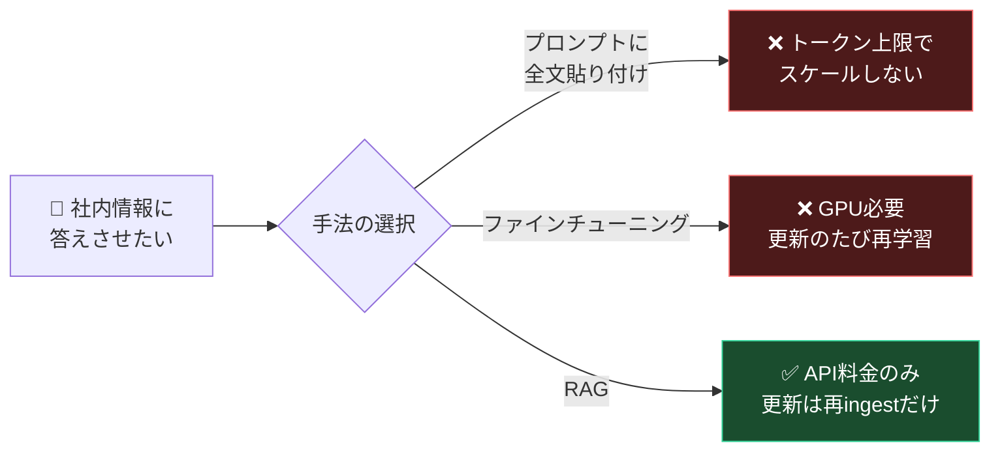
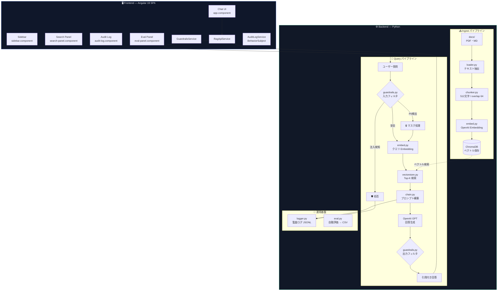
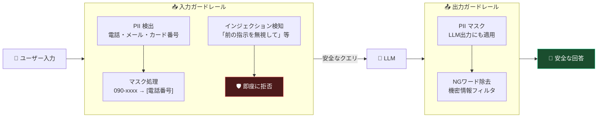
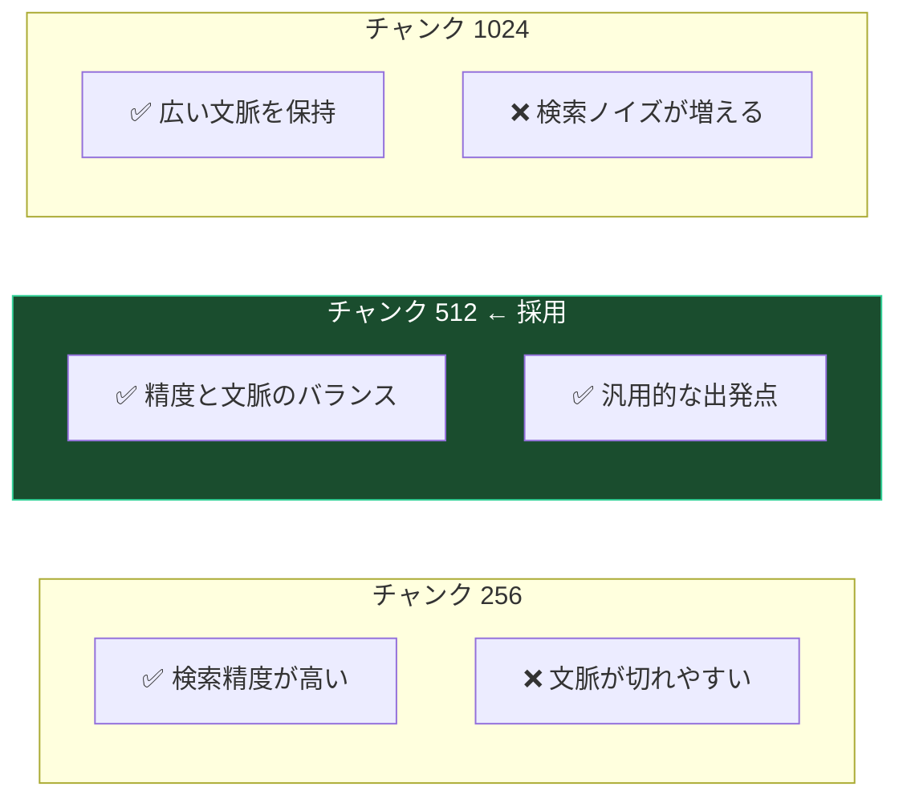
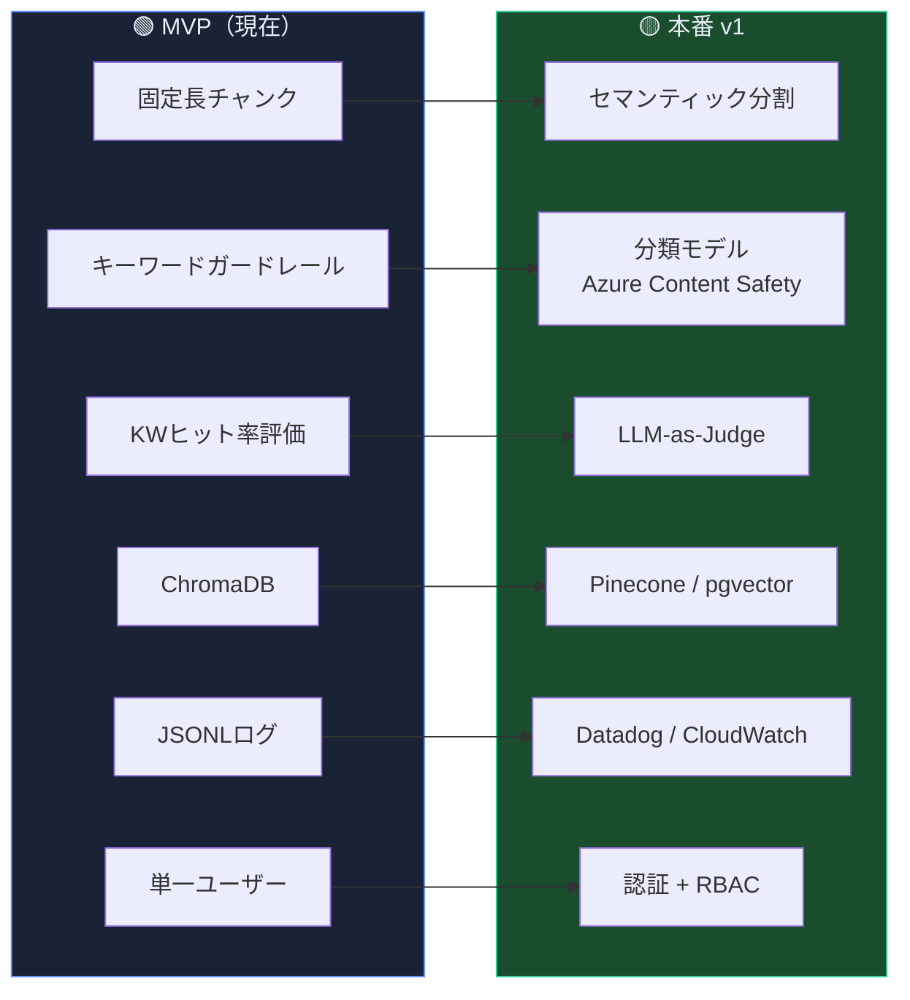

# 📚 RAG Agent Console

> **社内ドキュメントをベクトル検索し、根拠引用つきで回答する RAG チャットボット。**
> ガードレール・監査ログ・自動評価パイプラインを備えた、企業利用を意識した MVP です。


---

## デモ

| Angular SPA（フロントエンド） | Streamlit（バックエンド確認用） |
|:---:|:---:|
|  |  |

> スクリーンショットは `docs/images/` に配置してください

---

## このプロジェクトが解決する課題

```
❌ 従来の課題
   社内ドキュメントが増え続け、必要な情報を探すのに時間がかかる。
   LLM に直接聞いても、社内情報を知らないのでハルシネーション（もっともらしい嘘）を返す。

✅ RAG による解決
   「まず社内ドキュメントから関連箇所を検索し、それを根拠に LLM が回答する」
   → 嘘をつかない。出典が明示される。ドキュメント更新時も再学習不要。
```

---

## なぜ RAG を選んだか



| 手法 | コスト | セットアップ | ドキュメント更新 | 判断 |
|------|--------|-------------|-----------------|------|
| プロンプトに全文貼り付け | 安い | 簡単 | トークン上限に引っかかる | ✗ スケールしない |
| ファインチューニング | 高い (GPU) | 大変 | 再学習が必要 | ✗ MVP に不適 |
| **RAG** | **API 料金のみ** | **中程度** | **再 ingest のみ** | **✓ 採用** |

---

## システムアーキテクチャ

### 全体構成



### データフローの要約

```
📄 PDF/MD ──→ テキスト抽出 ──→ 512文字チャンク ──→ Embedding ──→ ChromaDB に保存
                                                                        │
👤 ユーザー質問 ──→ ガードレール ──→ Embedding ──→ ベクトル検索 ──────────┘
                     (PII/注入)                         │
                                                   Top-3 チャンク
                                                        │
                                                  プロンプト構築 ──→ GPT-4o-mini ──→ 出力フィルタ ──→ 💬 引用付き回答
```

---

## 主な機能

| 機能 | 実装内容 | なぜ入れたか |
|------|----------|-------------|
| **RAG パイプライン** | PDF/MD → チャンク → Embedding → Chroma → 検索 → LLM | ハルシネーション抑制。ドキュメント更新時も再学習不要 |
| **根拠引用** | 回答の各文に `[出典: ファイル名]` を自動付与 | ユーザーが原文を検証でき、回答の信頼性を担保 |
| **3層ガードレール** | 入力PII マスク / プロンプト注入検知 / 出力NG・PIIフィルタ | 企業利用では「動く」だけでなく「安全に動く」が必須 |
| **監査ログ** | 全クエリ・回答・ソースを JSONL で記録 | コンプライアンス対応。後付けすると全体に影響するため初期から設計 |
| **自動評価** | 10問の質問セットで回答率・引用率・KWヒット率・レイテンシを自動計測 | LLMアプリの「回帰テスト」。変更のたびに品質を自動検証 |
| **デバッグUI** | 検索 Top-K のチャンク内容・コサイン距離を展開表示 | 「検索が悪いのか、生成が悪いのか」を切り分けるため |
| **Angular SPA** | 3カラムレイアウト / リアルタイムガードレール状態表示 | SPA開発スキルの証明 + 本番フロントエンドの設計検証 |

---

## ガードレールの仕組み



**なぜ入力と出力の両方にフィルタが必要か：**
入力側でPIIをマスクしても、LLMが参考文書中の機密情報をそのまま出力する可能性がある。二重防御が企業利用の鉄則。

---

## 設計判断の詳細

### チャンクサイズ: 512 / オーバーラップ: 64



- **512 文字**: 検索精度（小さいほど良い）と文脈保持（大きいほど良い）のバランス
- **64 文字オーバーラップ** (≒12%): チャンク境界での情報欠落を防止
- 本番では `eval.py` の結果を見ながらドキュメント特性に合わせて調整

### Embedding モデル

| モデル | 次元数 | コスト | 判断 |
|--------|--------|--------|------|
| text-embedding-3-small | 1536 | 安い | **✓ MVP で採用** |
| text-embedding-3-large | 3072 | 約3倍 | 本番で検討 |
| OSS (e5-large 等) | 様々 | 無料 | オフライン要件時 |

`.env` の 1 行変更で切り替え可能な設計。`embed.py` だけの修正で OSS モデルにも対応可能。

### ベクトル DB: ChromaDB

- `pip install` だけで動く。外部サービス不要で「ローカル完結」要件に最適
- 本番では Pinecone / pgvector への移行を想定
- **`vectorstore.py` だけの差し替えで移行可能**な設計

### temperature: 0.2

- `0.0`: 完全決定的だが表現が硬い
- `0.2`: ほぼ決定的 + 自然な表現。**事実ベースの RAG に最適**
- `0.7+`: ハルシネーションリスクが上がる

---

## プロジェクト構成

```
rag-agent-console/
│
├── backend/                    ⚙️ Python RAG バックエンド
│   ├── rag/                    コアモジュール（単一責任で分割）
│   │   ├── config.py           .env 読み込み
│   │   ├── loader.py           PDF / MD テキスト抽出
│   │   ├── chunker.py          固定長チャンク分割
│   │   ├── embed.py            OpenAI Embedding ラッパー
│   │   ├── vectorstore.py      ChromaDB CRUD
│   │   ├── guardrails.py       PII マスク / 注入検知 / 出力フィルタ
│   │   ├── chain.py            検索 → LLM 回答チェーン
│   │   └── logger.py           監査ログ (JSONL)
│   ├── docs/                   取り込み対象ドキュメント
│   ├── eval/                   評価用質問 & 結果
│   ├── ingest.py               ドキュメント取り込みスクリプト
│   ├── app.py                  Streamlit チャット UI
│   └── eval.py                 自動評価スクリプト
│
├── frontend/                   🖥️ Angular 19 SPA
│   └── src/app/
│       ├── components/         UI コンポーネント（5つ）
│       │   ├── chat/           チャット画面 + 入力
│       │   ├── sidebar/        ナビ + ガードレール状態
│       │   ├── search-panel/   Top-K 検索結果表示
│       │   ├── audit-log/      監査ログビューア
│       │   └── eval-panel/     評価結果ダッシュボード
│       ├── services/           ビジネスロジック（3つ）
│       │   ├── rag-api.service.ts        RAG API 通信
│       │   ├── guardrails.service.ts     入出力フィルタ
│       │   └── audit-log.service.ts      ログ管理（RxJS）
│       └── models/
│           └── interfaces.ts   TypeScript 型定義
│
└── prototype/                  🎨 HTML プロトタイプ（UI 設計検証用）
```

**モジュール設計の方針：** 各ファイルを単一責任に保ち、「LLM を別プロバイダーに変えたい」「ベクトル DB を Pinecone に移したい」といった変更が 1 ファイルの修正で済むようにしています。

---

## 技術スタック

| レイヤー | 技術 | 選定理由 |
|----------|------|----------|
| **Frontend** | Angular 19 / TypeScript / SCSS / RxJS | Standalone Components で最新設計。BehaviorSubject でリアクティブなログ配信 |
| **Backend** | Python 3.9+ | LLM/ML エコシステムの中心。ライブラリが豊富 |
| **LLM** | OpenAI GPT-4o-mini | コスト効率が高い。環境変数で GPT-4o 等に切替可能 |
| **Embedding** | text-embedding-3-small | 安価で MVP に十分な精度。1行変更で large に切替可能 |
| **ベクトル DB** | ChromaDB | ローカル完結。pip install だけで使える |
| **UI（確認用）** | Streamlit | Python だけで即座に UI を構築 |
| **ガードレール** | 正規表現 + キーワードマッチ | MVP ではシンプルに。本番では分類モデルに置換 |
| **ログ** | JSONL | 追記型で DB 不要。jq / Datadog で分析可能 |
| **評価** | 自作スクリプト + CSV | CI に組み込み可能な自動回帰テスト |

---

## セットアップ

### 前提条件

- Python 3.9+
- Node.js 18+
- OpenAI API キー

### Backend

```bash
cd backend
python -m venv .venv && source .venv/bin/activate  # Windows: .venv\Scripts\activate
pip install -r requirements.txt
cp .env.example .env   # ← OPENAI_API_KEY を設定
python ingest.py        # ドキュメント取り込み
streamlit run app.py    # http://localhost:8501
python eval.py          # 自動評価 → eval/eval_results.csv
```

### Frontend

```bash
cd frontend
npm install
npx ng serve            # http://localhost:4200
```

---

## 評価結果

サンプルドキュメント（`sample_project.md`）での実行結果：

| 指標 | 結果 | 意味 |
|------|------|------|
| 回答率 | **10/10 (100%)** | 「見つかりません」ではなく回答できた割合 |
| 引用率 | **10/10 (100%)** | 出典が明示された割合 |
| KW ヒット率 | **18%** | キーワード完全一致（粗い指標） |
| 平均レイテンシ | **2.9s** | 質問から回答までの時間 |

> KW ヒット率が低いのは完全一致評価のため。LLM が同じ意味を別の言葉で表現した場合にヒットしない。
> 本番では **LLM-as-Judge**（GPT-4 に採点させる）に置き換えることで意味ベースの評価が可能。

---

## 本番に向けた拡張ロードマップ



| MVP の現状 | 本番での拡張 |
|-----------|-------------|
| 固定長チャンク (512) | セマンティック分割（見出し・段落単位） |
| キーワードガードレール | 分類モデル (Lakera Guard / Azure Content Safety) |
| KW ヒット率評価 | LLM-as-Judge（GPT-4 自動採点） |
| ChromaDB（ローカル） | Pinecone / pgvector（マネージド / 既存 DB 活用） |
| JSONL ファイルログ | 構造化ログ基盤（Datadog / CloudWatch） |
| 単一ユーザー | 認証 + RBAC + マルチテナント |

---

## トラブルシューティング

<details>
<summary><strong>❶ openai.AuthenticationError が出る</strong></summary>

`.env` に正しい API キーが設定されているか確認：

```bash
cat .env | grep OPENAI_API_KEY
python -c "from rag.config import OPENAI_API_KEY; print(OPENAI_API_KEY[:8])"
```

</details>

<details>
<summary><strong>❷ ChromaDB のエラー / 検索結果が空</strong></summary>

DB を削除して再構築：

```bash
rm -rf chroma_db/
python ingest.py
```

</details>

<details>
<summary><strong>❸ PDF からテキストが抽出できない（スキャン PDF）</strong></summary>

```bash
python -c "
from pypdf import PdfReader
r = PdfReader('docs/yourfile.pdf')
print(repr(r.pages[0].extract_text()[:200]))
"
```

テキストが空なら OCR 済み PDF に差し替えるか `pymupdf` / `pdfplumber` を検討。

</details>

<details>
<summary><strong>❹ Angular の ng serve でエラー</strong></summary>

```bash
cd frontend
rm -rf node_modules
npm install
npx ng serve
```

</details>

---

## ライセンス

MIT
