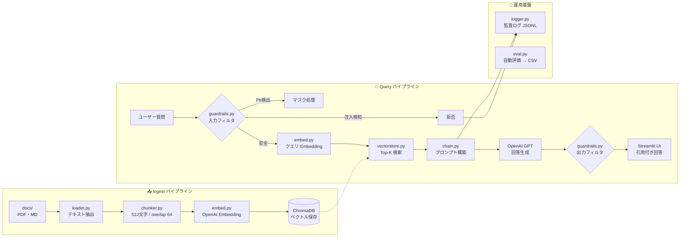

# 📚 RAG ローカル MVP — 社内ドキュメント検索チャットボット

> **PDF / Markdown を取り込み、ベクトル検索 + LLM で根拠引用付きの回答を生成する RAG システム。**
> ガードレール・監査ログ・自動評価を含む、企業利用を意識した最小実装です。


---

## デモ

| チャット画面 | 検索 Top-K デバッグ |
|:---:|:---:|
|  |  |

> ※ スクリーンショットは `docs/images/` に配置してください

---

## アーキテクチャ



---

## 主な特徴

| 機能 | 実装内容 | 設計意図 |
|------|----------|----------|
| **RAG パイプライン** | PDF/MD → チャンク → Embedding → Chroma → 検索 → LLM | ハルシネーション抑制。ドキュメント更新時も再学習不要 |
| **根拠引用** | 回答の各文に `[出典: ファイル名]` を付与 | ユーザーが原文を検証可能。信頼性の担保 |
| **3層ガードレール** | 入力PII マスク / プロンプト注入検知 / 出力NG・PIIフィルタ | 企業利用でのセキュリティ要件を初期から組み込み |
| **監査ログ** | 全クエリ・回答・ソースを JSONL で記録 | コンプライアンス対応。後から追加すると全体に影響するため初期から設計 |
| **自動評価** | 10問の質問セットで回答率・引用率・KWヒット率・レイテンシを自動計測 | LLMアプリの「回帰テスト」。変更のたびに品質を検証 |
| **デバッグUI** | 検索 Top-K のチャンク内容・コサイン距離を展開表示 | 検索精度の問題か生成精度の問題かを切り分けるため |

---

## 設計判断と根拠

### なぜ RAG か

| 手法 | コスト | セットアップ | ドキュメント更新 | 判断 |
|------|--------|-------------|-----------------|------|
| プロンプトに全文貼り付け | 安い | 簡単 | 簡単だがトークン上限に引っかかる | ✗ スケールしない |
| ファインチューニング | 高い (GPU) | 大変 | 再学習が必要 | ✗ MVP に不適 |
| **RAG** | **API 料金のみ** | **中程度** | **再 ingest のみ** | **✓ 採用** |

### チャンクサイズ: 512 / オーバーラップ: 64

- **512 文字**: 検索精度（小さいほど良い）と文脈保持（大きいほど良い）のバランス。MVP の出発点として汎用的なサイズ
- **64 文字オーバーラップ** (≒12%): チャンク境界での情報欠落を防止。大きすぎるとストレージ無駄、小さすぎると欠落リスク
- 本番では `eval.py` の結果を見ながら調整する前提

### Embedding: text-embedding-3-small

- MVP ではコストとセットアップの簡単さを優先し `small` を採用
- `.env` の 1 行変更で `large` に切り替え可能な設計
- オフライン要件がある場合は OSS モデル (e5-large 等) に差し替え可能

### ベクトル DB: ChromaDB

- `pip install` だけで動く。外部サービス不要で「ローカル完結」要件に最適
- 本番では Pinecone（マネージド）/ pgvector（既存 PostgreSQL 活用）への移行を想定
- **`vectorstore.py` だけの差し替えで移行可能**な設計にしている

### temperature: 0.2

- 0.0（完全決定的）だと表現が硬くなりすぎる
- 0.7 以上はハルシネーションリスクが上がる
- 事実ベースの RAG 回答には 0.1〜0.3 が推奨範囲

---

## フォルダ構成

```
rag-mvp/
├── .env.example          # 環境変数テンプレート（.env は Git 管理外）
├── .gitignore
├── requirements.txt
├── ingest.py             # ドキュメント取り込みスクリプト
├── app.py                # Streamlit チャット UI
├── eval.py               # 簡易評価スクリプト
│
├── rag/                  # コアモジュール（単一責任で分割）
│   ├── config.py         # .env 読み込み
│   ├── loader.py         # PDF / MD テキスト抽出
│   ├── chunker.py        # 固定長チャンク分割
│   ├── embed.py          # OpenAI Embedding ラッパー
│   ├── vectorstore.py    # ChromaDB CRUD
│   ├── guardrails.py     # PII マスク / 注入検知 / 出力フィルタ
│   ├── chain.py          # 検索 → LLM 回答チェーン
│   └── logger.py         # 監査ログ (JSONL)
│
├── docs/                 # 取り込み対象ドキュメント
├── eval/
│   ├── eval_questions.json   # 評価用質問セット
│   └── eval_results.csv      # 評価結果（自動生成）
├── logs/
│   └── audit.jsonl           # 監査ログ（自動生成）
└── chroma_db/                # Chroma 永続化（自動生成・Git 管理外）
```

**モジュール設計の意図**: 各ファイルを単一責任に保ち、「LLM を別プロバイダーに変えたい」「ベクトル DB を Pinecone に移したい」といった変更が 1 ファイルの修正で済むようにしています。Spring の Controller / Service / Repository パターンと同じ考え方です。

---

## セットアップ

### 前提条件

- Python 3.9+
- OpenAI API キー

### 手順

```bash
# 1. クローン
git clone https://github.com/YOUR_USERNAME/rag-mvp.git
cd rag-mvp

# 2. 仮想環境 & 依存インストール
python -m venv .venv
source .venv/bin/activate    # Windows: .venv\Scripts\activate
pip install -r requirements.txt

# 3. 環境変数
cp .env.example .env
# .env を開いて OPENAI_API_KEY を設定

# 4. ドキュメント取り込み
# docs/ に PDF / MD を配置してから:
python ingest.py

# 5. チャット UI 起動
streamlit run app.py
# → http://localhost:8501

# 6. 自動評価
python eval.py
# → eval/eval_results.csv に結果出力
```

---

## 評価結果（サンプルドキュメントでの実行例）

| 指標 | 結果 |
|------|------|
| 回答率 | 10/10 (100%) |
| 引用率 | 10/10 (100%) |
| KW ヒット率 | 18% |
| 平均レイテンシ | 2.9s |

> KW ヒット率はキーワード完全一致の粗い指標です。本番では LLM-as-Judge（GPT-4 による自動採点）に置き換えることで、より正確な品質計測が可能です。

---

## 本番に向けた拡張ロードマップ

| MVP の現状 | 本番での拡張 |
|-----------|-------------|
| 固定長チャンク (512) | セマンティック分割（見出し・段落単位） |
| キーワードガードレール | 分類モデル (Lakera Guard / Azure Content Safety) |
| KW ヒット率評価 | LLM-as-Judge（GPT-4 自動採点） |
| ChromaDB（ローカル） | Pinecone / pgvector（マネージド / 既存 DB 活用） |
| JSONL ファイルログ | 構造化ログ基盤（Datadog / CloudWatch） |
| 単一ユーザー | 認証 + RBAC + マルチテナント |

---

## 技術スタック

| カテゴリ | 技術 |
|----------|------|
| 言語 | Python 3.9+ |
| LLM | OpenAI GPT-4o-mini（環境変数で変更可能） |
| Embedding | OpenAI text-embedding-3-small（同上） |
| ベクトル DB | ChromaDB（ローカル永続化） |
| UI | Streamlit |
| ガードレール | 正規表現 PII マスク + キーワード注入検知 |
| ログ | JSONL 監査ログ |
| 評価 | 自動評価スクリプト + CSV 集計 |

---

## トラブルシューティング

<details>
<summary><strong>❶ openai.AuthenticationError が出る</strong></summary>

`.env` に正しい API キーが設定されているか確認:

```bash
cat .env | grep OPENAI_API_KEY
python -c "from rag.config import OPENAI_API_KEY; print(OPENAI_API_KEY[:8])"
```

</details>

<details>
<summary><strong>❷ ChromaDB のエラー / 検索結果が空</strong></summary>

DB を削除して再構築:

```bash
rm -rf chroma_db/
python ingest.py
```

</details>

<details>
<summary><strong>❸ PDF からテキストが抽出できない</strong></summary>

スキャン PDF の場合はテキストが抽出できません:

```bash
python -c "
from pypdf import PdfReader
r = PdfReader('docs/yourfile.pdf')
print(repr(r.pages[0].extract_text()[:200]))
"
```

テキストが空なら OCR 済み PDF に差し替えるか、`pymupdf` / `pdfplumber` を検討してください。

</details>

---

## .gitignore

```
.env
.venv/
chroma_db/
logs/
eval/eval_results.csv
__pycache__/
*.pyc
```

---

## ライセンス

MIT
